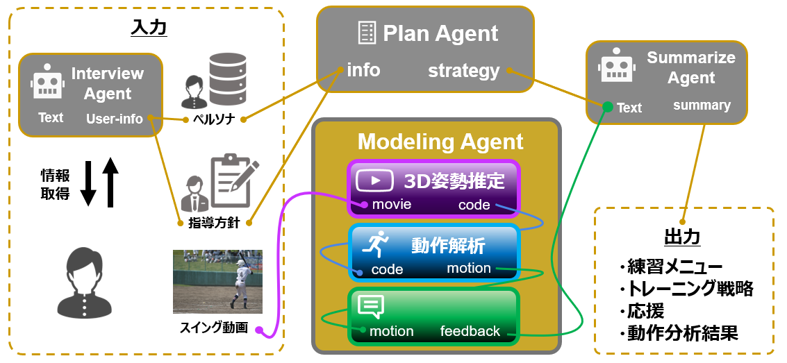

# LLM Baseball Swing Coach


本プロジェクトは、AKATSUKIプロジェクト採択「関西テッククリエイターチャレンジ」にて開発された，AIを活用して野球選手のバッティングフォームを分析し，個別化されたコーチングを提供するシステムです．3D姿勢推定技術とLLMを組み合わせることで，選手のスイングを詳細に分析し，具体的な改善アドバイスを提供します．

## 特徴
- 3D姿勢推定による詳細なスイング分析
- インタラクティブな対話による選手理解
- 個別化された目標設定と練習プラン作成
- AIによる総合的なコーチングレポート生成
- StreamlitベースのWebインターフェース

## インストール方法

1. リポジトリのクローン：
```bash
git clone [リポジトリURL]
cd llm-baseball-swing-coach
```

2. 依存パッケージのインストール：
```bash
pip install -r requirements.txt
```

3. 事前学習モデルのダウンロード：
- ディレクトリの作成
   ```bash
   mkdir MotionAGFormer/checkpoint
   mkfir MotionAGFormer/run/lib/checkpoint
   ```
- [YOLOv3とHRNetの事前学習モデル](https://drive.google.com/drive/folders/1_ENAMOsPM7FXmdYRbkwbFHgzQq_B_NQA?usp=sharing)をダウンロードし、`MotionAGFormer/run/lib/checkpoint/`に配置
- [MotionAGFormerのベースモデル](https://drive.google.com/file/d/1Iii5EwsFFm9_9lKBUPfN8bV5LmfkNUMP/view)をダウンロードし、`MotionAGFormer/checkpoint/`に配置

MotionAGFormer[参照](https://github.com/TaatiTeam/MotionAGFormer)

4. 環境変数の設定：
.envファイルに以下を
```bash
touch .env
# .envファイルを編集し、OPENAI_API_KEYなどのキーを設定
```
以下がファイル内の例
```bash
OPENAI_API_KEY=sk-****
GOOGLE_API_KEY=AIz****
SEARCH_ENGINE_ID=86****
```

## 使用方法

### WebUIでの実行
```bash
streamlit run app.py
```

### コマンドラインでの実行
```bash
python main.py --json info.json --user_video path/to/video.mp4
```

#### オプション
- `--json`: 選手情報を含むJSONファイルのパス（必須）
- `--user_video`: 分析対象の動画ファイルパス
- `--user_pose_json`: 3D姿勢データ（JSONファイル）のパス
- `--ideal_video`: 理想フォームの動画ファイルパス（オプション）
- `--ideal_pose_json`: 理想フォームの3D姿勢データ（オプション）

## 主な機能



1. **3D姿勢推定と分析**
   - スイング動画からの3D姿勢推定
   - バットスピード、回転の連動性などの定量的分析
   - 理想フォームとの比較分析

2. **インタラクティブコーチング**
   - 選手との対話による情報収集
   - 個別の課題やニーズの把握
   - カスタマイズされたアドバイス提供

3. **トレーニングプラン作成**
   - 分析結果に基づく具体的な練習メニュー
   - 段階的な目標設定
   - 実行可能な練習スケジュール

4. **総合レポート生成**
   - スイング分析結果のまとめ
   - 改善ポイントの提示
   - 具体的なアクションプラン

## システム構成
```
llm-baseball-swing-coach/
├── agents/           # 各種AIエージェント
├── core/            # システムコア機能
├── models/          # データモデル定義
├── utils/           # ユーティリティ関数
├── config/          # 設定ファイル
└── MotionAGFormer/  # 3D姿勢推定モデル
```

## 参考文献
- [MHFormer](https://github.com/Vegetebird/MHFormer)
- その他関連論文やプロジェクト

## 注意事項
- このシステムはアシスタントとして機能することを目的としており、プロのコーチの判断を完全に代替するものではありません。
- 動画分析には高性能なGPUを推奨します。
- APIキーの利用には別途OpenAIのアカウントとクレジットが必要です。
